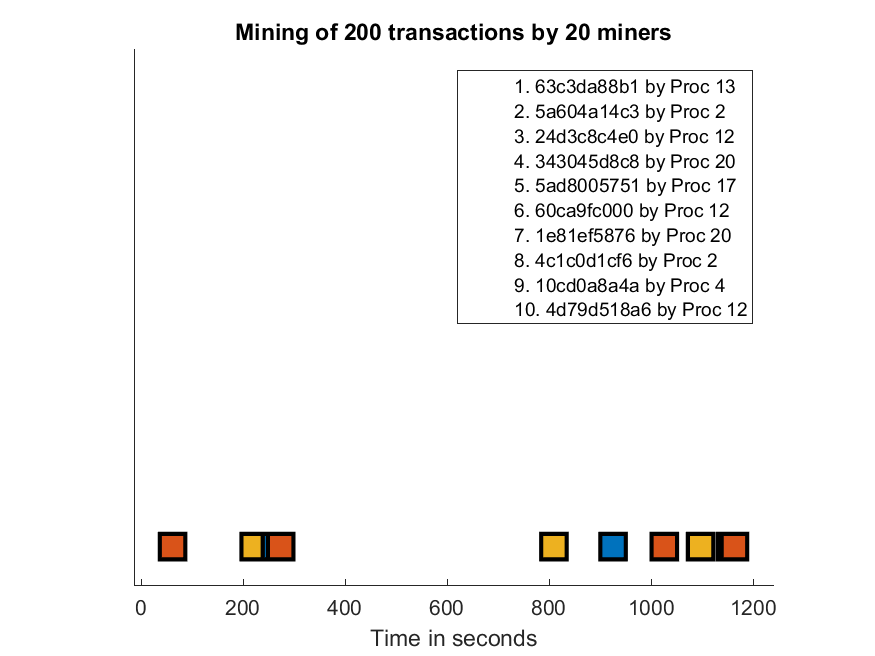

# Blockchain simulation, logs analyzer

## Introduction

This part analyzes the logs produced during a blockchain execution simulation.

The goal is to sum up the work done by the miners, how many rewards they won and how the blockchain has evolved in time.

## Results

### Miners' rewards

First, we look at the miners' clock rate, the rewards they won and the number of forks they've done.

* The frequency tells us the computational power of the miner in the network.

* The rewards refers to the number of blocks they've mined.

* A low number of forks indicates that the miners found easily a consensus to determine the next block. And it also means that several miners didn't find a block at the same time very often.

### Blockchain evolution

We can also visualize the evolution of the longest chain in the end. The next two figures show an example of the 10 first and 10 last blocks of 1000 transactions mined by 20 nodes.

(Here, the time is in milliseconds for testing purposes but in the real world, we should have 10 minutes between each block)

